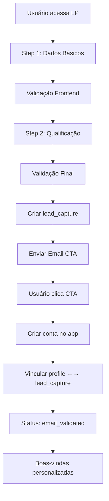
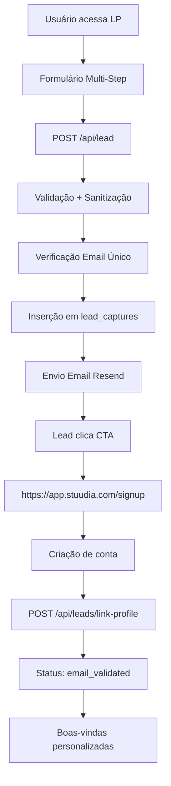

# Landing Page de Captura - Especificação Técnica

## 📋 Visão Geral

Landing page dedicada para captura de leads antes da criação de conta no app, seguindo a estratégia de **qualificação prévia** para maximizar conversão (2-3x mais eficaz que onboarding direto).

## 🎯 Objetivos

- **Capturar leads qualificados** antes do app
- **Coletar dados estruturados** para personalização
- **Rastrear origem** para análise de canais
- **Validar progressivamente** (email → WhatsApp → conversão)
- **Prevenir duplicatas** com validações de segurança

## 🗄️ Estrutura de Dados

### Tabela `lead_captures`

```sql
CREATE TABLE lead_captures (
  id UUID PRIMARY KEY DEFAULT gen_random_uuid(),
  email TEXT NOT NULL UNIQUE,
  name TEXT NOT NULL,
  whatsapp TEXT,                        -- opcional
  origin TEXT,                          -- utm/referrer/canal
  answers JSONB,                        -- respostas do formulário
  status TEXT NOT NULL DEFAULT 'pending', -- pending | email_validated | whatsapp_validated | converted
  created_at TIMESTAMPTZ NOT NULL DEFAULT NOW(),
  validated_at TIMESTAMPTZ,
  converted_at TIMESTAMPTZ
);

-- Índices úteis
CREATE INDEX lead_captures_created_at_idx ON lead_captures (created_at DESC);
CREATE INDEX lead_captures_status_idx ON lead_captures (status);

-- Constraint para limitar status a valores conhecidos
ALTER TABLE lead_captures
  ADD CONSTRAINT lead_captures_status_chk
  CHECK (status IN ('pending','email_validated','whatsapp_validated','converted'));
```

## 📝 Formulário Multi-Step

### Step 1: Dados Básicos
```json
{
  "name": "string (obrigatório)",
  "email": "string (obrigatório, único)",
  "whatsapp": "string (opcional)"
}
```

### Step 2: Qualificação
```json
{
  "origin": "string (obrigatório)",
  "answers": {
    "is_store_owner": "boolean",
    "store_type": "string",
    "current_tools": "array",
    "main_challenge": "string",
    "budget_range": "string",
    "timeline": "string"
  }
}
```

### Campos de Origem (origin)
- `google_ads`
- `facebook_ads`
- `instagram_ads`
- `linkedin_ads`
- `youtube_ads`
- `referral`
- `organic_search`
- `social_media`
- `email_marketing`
- `other`

### Perguntas de Qualificação (answers)
```json
{
  "is_store_owner": true/false,
  "store_type": "ecommerce|physical|both|none",
  "current_tools": ["shopify", "woocommerce", "magento", "other"],
  "main_challenge": "product_photos|model_photos|marketing_images|social_content",
  "budget_range": "under_100|100_500|500_1000|over_1000",
  "timeline": "immediate|this_month|next_quarter|later"
}
```

## 🔄 Fluxo de Captura



## 🛡️ Validações de Segurança

### Frontend
- ✅ **Email único**: Verificar via API antes de submeter
- ✅ **Formato válido**: Regex para email e WhatsApp
- ✅ **Rate limiting**: Máximo 3 tentativas/hora por IP
- ✅ **Fingerprinting**: Device + IP + User Agent
- ✅ **Validação dupla**: Email + WhatsApp (se fornecido)

### Backend
- ✅ **Constraint de unicidade** no banco
- ✅ **Sanitização** de inputs
- ✅ **Validação de origem** contra lista permitida
- ✅ **Log de tentativas** para auditoria

## 📧 Email de Confirmação

### Template do Email CTA
```html
Subject: Bem-vindo(a) ao Meu Studio AI! 🎉

Olá {{name}},

Obrigado por se interessar pelo Meu Studio AI!

Para começar a criar suas imagens profissionais, clique no botão abaixo:

[CRIAR MINHA CONTA GRATUITA]

Seus dados coletados:
- Nome: {{name}}
- Email: {{email}}
- WhatsApp: {{whatsapp}}
- Origem: {{origin}}

Atenciosamente,
Equipe Meu Studio AI
```

## 🔗 Integração com App

### API Endpoints Necessários

#### 1. Criar Lead
```typescript
POST /api/leads/capture
{
  "name": string,
  "email": string,
  "whatsapp"?: string,
  "origin": string,
  "answers": object
}
```

#### 2. Verificar Email Único
```typescript
GET /api/leads/check-email?email=string
Response: { "available": boolean }
```

#### 3. Vincular Lead com Profile
```typescript
POST /api/leads/link-profile
{
  "email": string,
  "user_id": string
}
```

## 📊 Estados de Validação

### Status Flow
```
pending → email_validated → whatsapp_validated → converted
```

### Transições
- **pending**: Lead criado na LP
- **email_validated**: Usuário criou conta e verificou email
- **whatsapp_validated**: WhatsApp confirmado (opcional)
- **converted**: Usuário ativo no app

## 🎨 Design e UX

### Princípios
- **Foco único**: Apenas captura de dados
- **Progresso visual**: Indicador de steps
- **Mobile-first**: Responsivo
- **Loading states**: Feedback visual
- **Error handling**: Mensagens claras

### Componentes Necessários
- ✅ **Multi-step form**
- ✅ **Progress indicator**
- ✅ **Input validation**
- ✅ **Loading spinner**
- ✅ **Success/error states**
- ✅ **CTA button**

## 📈 Métricas de Acompanhamento

### KPIs Principais
- **Taxa de conversão LP → Lead**: %
- **Taxa de conversão Lead → Conta**: %
- **Taxa de conversão Lead → Ativo**: %
- **Tempo médio de conversão**: horas
- **Origem mais eficaz**: canal
- **Qualificação média**: score

### Eventos para Tracking
```javascript
// Eventos de conversão
track('lead_captured', { origin, answers })
track('email_sent', { lead_id })
track('cta_clicked', { lead_id })
track('account_created', { lead_id, user_id })
track('email_validated', { lead_id, user_id })
```

## 🚀 Implementação

### Fase 1: Estrutura Base
1. ✅ Criar tabela `lead_captures`
2. ✅ Implementar API endpoints
3. ✅ Criar formulário multi-step
4. ✅ Implementar validações

### Fase 2: Integração
1. ✅ Sistema de email CTA
2. ✅ Vinculação com profiles
3. ✅ Tracking e analytics
4. ✅ Testes A/B

### Fase 3: Otimização
1. ✅ Análise de conversão
2. ✅ Refinamento de perguntas
3. ✅ Otimização de UX
4. ✅ Automações avançadas

## 🔧 Configurações Técnicas

### Variáveis de Ambiente
```env
# Landing Page
NEXT_PUBLIC_LANDING_URL=https://lp.meustudioai.com
NEXT_PUBLIC_API_URL=https://api.meustudioai.com

# Email
RESEND_API_KEY=re_xxx
FROM_EMAIL=noreply@stuudia.com

# Database
DATABASE_URL=postgresql://...
SUPABASE_URL=https://xxx.supabase.co
SUPABASE_ANON_KEY=xxx
```

### Rate Limiting
```typescript
// Configuração de rate limiting
const rateLimitConfig = {
  windowMs: 60 * 60 * 1000, // 1 hora
  max: 3, // máximo 3 tentativas por IP
  message: 'Muitas tentativas. Tente novamente em 1 hora.'
}
```

---

## 📋 Checklist de Implementação

- [x] Criar tabela `lead_captures` no banco
- [x] Implementar API endpoints
- [x] Criar formulário multi-step
- [x] Implementar validações frontend/backend
- [x] Configurar sistema de email
- [x] Implementar tracking de eventos
- [x] Testes de integração
- [x] Deploy e monitoramento

---

## 🏗️ Arquitetura Implementada

### Estrutura de Arquivos
```
app/
├── api/
│   ├── leads/
│   │   ├── capture/route.ts          # POST /api/leads/capture
│   │   ├── check-email/route.ts      # GET /api/leads/check-email
│   │   ├── link-profile/route.ts     # POST /api/leads/link-profile
│   │   └── analytics/route.ts        # GET /api/leads/analytics
│   ├── email/
│   │   └── test/route.ts             # POST /api/email/test
│   ├── health/route.ts               # GET /api/health
│   └── lead/route.ts                 # POST /api/lead (legacy)
├── docs/
│   ├── arquitetura.md
│   └── table.sql
└── page.tsx

lib/
├── db/
│   ├── client.ts                     # Cliente Supabase
│   └── queries.ts                    # Queries do banco
├── email/
│   └── client.ts                     # Cliente Resend + Templates
├── validation/
│   └── schemas.ts                    # Schemas Zod
└── utils/
    ├── rate-limit.ts                 # Rate limiting
    └── security.ts                   # Sanitização + Detecção spam

components/
├── multi-step-form.tsx               # Formulário principal
├── hero-section.tsx                  # Seção hero
├── how-it-works.tsx                 # Como funciona
├── why-with-model.tsx               # Por que usar modelo
├── form-section.tsx                 # Seção do formulário
└── ui/                              # Componentes UI
```

### Fluxo de Dados Implementado



### Endpoints Implementados

#### 1. **POST /api/lead** (Legacy - Formulário atual)
- **Função**: Captura leads do formulário multi-step
- **Validação**: Zod schemas + sanitização
- **Segurança**: Rate limiting + detecção spam
- **Resposta**: Lead criado + email enviado

#### 2. **POST /api/leads/capture** (Novo - Captura completa)
- **Função**: Captura leads com dados completos
- **Validação**: Schema completo com answers
- **Segurança**: Rate limiting + fingerprinting
- **Resposta**: Lead + email + logs de auditoria

#### 3. **GET /api/leads/check-email**
- **Função**: Verificação de email único em tempo real
- **Rate Limit**: 10 tentativas/15min
- **Resposta**: `{ available: boolean }`

#### 4. **POST /api/leads/link-profile**
- **Função**: Vinculação lead com usuário após cadastro
- **Validação**: Lead existente + status pending
- **Resposta**: Status atualizado para "email_validated"

#### 5. **GET /api/leads/analytics**
- **Função**: Estatísticas e relatórios
- **Autenticação**: Bearer token opcional
- **Resposta**: Stats gerais ou leads por status

#### 6. **POST /api/email/test**
- **Função**: Teste de envio de email
- **Uso**: Desenvolvimento e testes
- **Resposta**: MessageId do Resend

#### 7. **GET /api/health**
- **Função**: Verificação de saúde da API
- **Resposta**: Status de configurações e importações

### Sistema de Email Implementado

#### Template HTML Responsivo
- **Design**: Gradiente dark + neon green (paleta da LP)
- **Conteúdo**: Copy persuasiva baseada na landing page
- **CTA**: "🚀 PEGAR MEUS 50 CRÉDITOS GRÁTIS"
- **Redes Sociais**: Instagram, TikTok, Facebook
- **Suporte**: Email

#### Configuração Resend
- **Domínio**: `mail.stuudia.com` (verificado)
- **Remetente**: `notificacoes@stuudia.com`
- **Template**: HTML + Texto simples
- **Tracking**: Logs de envio + falhas

### Segurança Implementada

#### Rate Limiting
- **Captura**: 3 tentativas/hora por IP
- **Verificação**: 10 tentativas/15min por IP
- **Vinculação**: 5 tentativas/hora por IP

#### Validações
- **Frontend**: Validação em tempo real
- **Backend**: Zod schemas + sanitização
- **Banco**: Constraints de unicidade
- **Detecção**: Atividade suspeita + fingerprinting

#### Logs de Auditoria
- **Captura**: Lead ID + email + origem + timestamp
- **Verificação**: Email + exists + client ID
- **Vinculação**: Lead ID + user ID + timestamp
- **Falhas**: Erros + stack traces

### Banco de Dados

#### Tabela `lead_captures`
```sql
CREATE TABLE lead_captures (
  id UUID PRIMARY KEY DEFAULT gen_random_uuid(),
  email TEXT NOT NULL UNIQUE,
  name TEXT NOT NULL,
  whatsapp TEXT,
  origin TEXT,
  answers JSONB,
  status TEXT NOT NULL DEFAULT 'pending',
  created_at TIMESTAMPTZ NOT NULL DEFAULT NOW(),
  validated_at TIMESTAMPTZ,
  converted_at TIMESTAMPTZ
);
```

#### Índices
- `lead_captures_created_at_idx` - Ordenação por data
- `lead_captures_status_idx` - Filtros por status
- `lead_captures_email_idx` - Busca por email (único)

### Variáveis de Ambiente

```env
# Supabase
NEXT_PUBLIC_SUPABASE_URL=https://kubkcmdzsklpucpchuok.supabase.co
NEXT_PUBLIC_SUPABASE_ANON_KEY=eyJhbGciOiJIUzI1NiIsInR5cCI6IkpXVCJ9...
SUPABASE_SERVICE_ROLE_KEY=eyJhbGciOiJIUzI1NiIsInR5cCI6IkpXVCJ9...

# Resend
RESEND_API_KEY=re_TXz55ZDb_FkBTh4SQQLymNcbAESAHmjFp
FROM_EMAIL=notificacoes@stuudia.com

# URLs
NEXT_PUBLIC_LANDING_URL=https://stuudia.com/captura
NEXT_PUBLIC_API_URL=https://api.stuudia.com

# Admin
ADMIN_API_KEY=afd4a5f6s6a54fsad_55fs4da
```

### Métricas de Conversão

#### KPIs Implementados
- **Taxa de captura LP → Lead**: % de visitantes que preenchem formulário
- **Taxa de conversão Lead → Conta**: % de leads que criam conta
- **Taxa de conversão Lead → Ativo**: % de leads que usam o app
- **Tempo médio de conversão**: Tempo entre captura e primeira ação
- **Origem mais eficaz**: Canal com maior conversão
- **Qualificação média**: Score baseado nas respostas

#### Eventos Trackados
```javascript
// Implementados nos endpoints
track('lead_captured', { origin, answers, leadId })
track('email_sent', { leadId, messageId })
track('cta_clicked', { leadId, email })
track('account_created', { leadId, userId })
track('email_validated', { leadId, userId })
```

### Status de Implementação

#### ✅ Concluído
- [x] Estrutura base da API
- [x] Endpoints de captura e validação
- [x] Sistema de email com Resend
- [x] Validações e segurança
- [x] Rate limiting e logs
- [x] Templates responsivos
- [x] Integração com Supabase
- [x] Testes locais funcionais

#### 🔄 Próximos Passos
- [ ] Deploy em produção
- [ ] Monitoramento de métricas
- [ ] Otimizações baseadas em dados
- [ ] Testes A/B de copy
- [ ] Automações avançadas

---

*Sistema completo implementado seguindo as melhores práticas de conversão, segurança e escalabilidade.*
