# Landing Page de Captura - Especificação Técnica

## 📋 Visão Geral

Landing page dedicada para captura de leads antes da criação de conta no app, seguindo a estratégia de **qualificação prévia** para maximizar conversão (2-3x mais eficaz que onboarding direto).

## 🎯 Objetivos

- **Capturar leads qualificados** antes do app
- **Coletar dados estruturados** para personalização
- **Rastrear origem** para análise de canais
- **Validar progressivamente** (email → WhatsApp → conversão)
- **Prevenir duplicatas** com validações de segurança

## 🗄️ Estrutura de Dados

### Tabela `lead_captures`

```sql
CREATE TABLE lead_captures (
  id UUID PRIMARY KEY DEFAULT gen_random_uuid(),
  email TEXT NOT NULL UNIQUE,
  name TEXT NOT NULL,
  whatsapp TEXT,                        -- opcional
  origin TEXT,                          -- utm/referrer/canal
  answers JSONB,                        -- respostas do formulário
  status TEXT NOT NULL DEFAULT 'pending', -- pending | email_validated | whatsapp_validated | converted
  created_at TIMESTAMPTZ NOT NULL DEFAULT NOW(),
  validated_at TIMESTAMPTZ,
  converted_at TIMESTAMPTZ
);

-- Índices úteis
CREATE INDEX lead_captures_created_at_idx ON lead_captures (created_at DESC);
CREATE INDEX lead_captures_status_idx ON lead_captures (status);

-- Constraint para limitar status a valores conhecidos
ALTER TABLE lead_captures
  ADD CONSTRAINT lead_captures_status_chk
  CHECK (status IN ('pending','email_validated','whatsapp_validated','converted'));
```

## 📝 Formulário Multi-Step

### Step 1: Dados Básicos
```json
{
  "name": "string (obrigatório)",
  "email": "string (obrigatório, único)",
  "whatsapp": "string (opcional)"
}
```

### Step 2: Qualificação
```json
{
  "origin": "string (obrigatório)",
  "answers": {
    "is_store_owner": "boolean",
    "store_type": "string",
    "current_tools": "array",
    "main_challenge": "string",
    "budget_range": "string",
    "timeline": "string"
  }
}
```

### Campos de Origem (origin)
- `google_ads`
- `facebook_ads`
- `instagram_ads`
- `linkedin_ads`
- `youtube_ads`
- `referral`
- `organic_search`
- `social_media`
- `email_marketing`
- `other`

### Perguntas de Qualificação (answers)
```json
{
  "is_store_owner": true/false,
  "store_type": "ecommerce|physical|both|none",
  "current_tools": ["shopify", "woocommerce", "magento", "other"],
  "main_challenge": "product_photos|model_photos|marketing_images|social_content",
  "budget_range": "under_100|100_500|500_1000|over_1000",
  "timeline": "immediate|this_month|next_quarter|later"
}
```

## 🔄 Fluxo de Captura

```mermaid
graph TD
    A[Usuário acessa LP] --> B[Step 1: Dados Básicos]
    B --> C[Validação Frontend]
    C --> D[Step 2: Qualificação]
    D --> E[Validação Final]
    E --> F[Criar lead_capture]
    F --> G[Enviar Email CTA]
    G --> H[Usuário clica CTA]
    H --> I[Criar conta no app]
    I --> J[Vincular profile ←→ lead_capture]
    J --> K[Status: email_validated]
    K --> L[Boas-vindas personalizadas]
```



## 🛡️ Validações de Segurança

### Frontend
- ✅ **Email único**: Verificar via API antes de submeter
- ✅ **Formato válido**: Regex para email e WhatsApp
- ✅ **Rate limiting**: Máximo 3 tentativas/hora por IP
- ✅ **Fingerprinting**: Device + IP + User Agent
- ✅ **Validação dupla**: Email + WhatsApp (se fornecido)

### Backend
- ✅ **Constraint de unicidade** no banco
- ✅ **Sanitização** de inputs
- ✅ **Validação de origem** contra lista permitida
- ✅ **Log de tentativas** para auditoria

## 📧 Email de Confirmação

### Template do Email CTA
```html
Subject: Bem-vindo(a) ao Meu Studio AI! 🎉

Olá {{name}},

Obrigado por se interessar pelo Meu Studio AI!

Para começar a criar suas imagens profissionais, clique no botão abaixo:

[CRIAR MINHA CONTA GRATUITA]

Seus dados coletados:
- Nome: {{name}}
- Email: {{email}}
- WhatsApp: {{whatsapp}}
- Origem: {{origin}}

Atenciosamente,
Equipe Meu Studio AI
```

## 🔗 Integração com App

### API Endpoints Necessários

#### 1. Criar Lead
```typescript
POST /api/leads/capture
{
  "name": string,
  "email": string,
  "whatsapp"?: string,
  "origin": string,
  "answers": object
}
```

#### 2. Verificar Email Único
```typescript
GET /api/leads/check-email?email=string
Response: { "available": boolean }
```

#### 3. Vincular Lead com Profile
```typescript
POST /api/leads/link-profile
{
  "email": string,
  "user_id": string
}
```

## 📊 Estados de Validação

### Status Flow
```
pending → email_validated → whatsapp_validated → converted
```

### Transições
- **pending**: Lead criado na LP
- **email_validated**: Usuário criou conta e verificou email
- **whatsapp_validated**: WhatsApp confirmado (opcional)
- **converted**: Usuário ativo no app

## 🎨 Design e UX

### Princípios
- **Foco único**: Apenas captura de dados
- **Progresso visual**: Indicador de steps
- **Mobile-first**: Responsivo
- **Loading states**: Feedback visual
- **Error handling**: Mensagens claras

### Componentes Necessários
- ✅ **Multi-step form**
- ✅ **Progress indicator**
- ✅ **Input validation**
- ✅ **Loading spinner**
- ✅ **Success/error states**
- ✅ **CTA button**

## 📈 Métricas de Acompanhamento

### KPIs Principais
- **Taxa de conversão LP → Lead**: %
- **Taxa de conversão Lead → Conta**: %
- **Taxa de conversão Lead → Ativo**: %
- **Tempo médio de conversão**: horas
- **Origem mais eficaz**: canal
- **Qualificação média**: score

### Eventos para Tracking
```javascript
// Eventos de conversão
track('lead_captured', { origin, answers })
track('email_sent', { lead_id })
track('cta_clicked', { lead_id })
track('account_created', { lead_id, user_id })
track('email_validated', { lead_id, user_id })
```

## 🚀 Implementação

### Fase 1: Estrutura Base
1. ✅ Criar tabela `lead_captures`
2. ✅ Implementar API endpoints
3. ✅ Criar formulário multi-step
4. ✅ Implementar validações

### Fase 2: Integração
1. ✅ Sistema de email CTA
2. ✅ Vinculação com profiles
3. ✅ Tracking e analytics
4. ✅ Testes A/B

### Fase 3: Otimização
1. ✅ Análise de conversão
2. ✅ Refinamento de perguntas
3. ✅ Otimização de UX
4. ✅ Automações avançadas

## 🔧 Configurações Técnicas

### Variáveis de Ambiente
```env
# Landing Page
NEXT_PUBLIC_LANDING_URL=https://lp.meustudioai.com
NEXT_PUBLIC_API_URL=https://api.meustudioai.com

# Email
RESEND_API_KEY=re_xxx
FROM_EMAIL=noreply@meustudioai.com

# Database
DATABASE_URL=postgresql://...
SUPABASE_URL=https://xxx.supabase.co
SUPABASE_ANON_KEY=xxx
```

### Rate Limiting
```typescript
// Configuração de rate limiting
const rateLimitConfig = {
  windowMs: 60 * 60 * 1000, // 1 hora
  max: 3, // máximo 3 tentativas por IP
  message: 'Muitas tentativas. Tente novamente em 1 hora.'
}
```

---

## 📋 Checklist de Implementação

- [ ] Criar tabela `lead_captures` no banco
- [ ] Implementar API endpoints
- [ ] Criar formulário multi-step
- [ ] Implementar validações frontend/backend
- [ ] Configurar sistema de email
- [ ] Implementar tracking de eventos
- [ ] Testes de integração
- [ ] Deploy e monitoramento

---

*Este documento serve como especificação completa para implementação da landing page de captura, seguindo as melhores práticas de conversão e segurança.*
